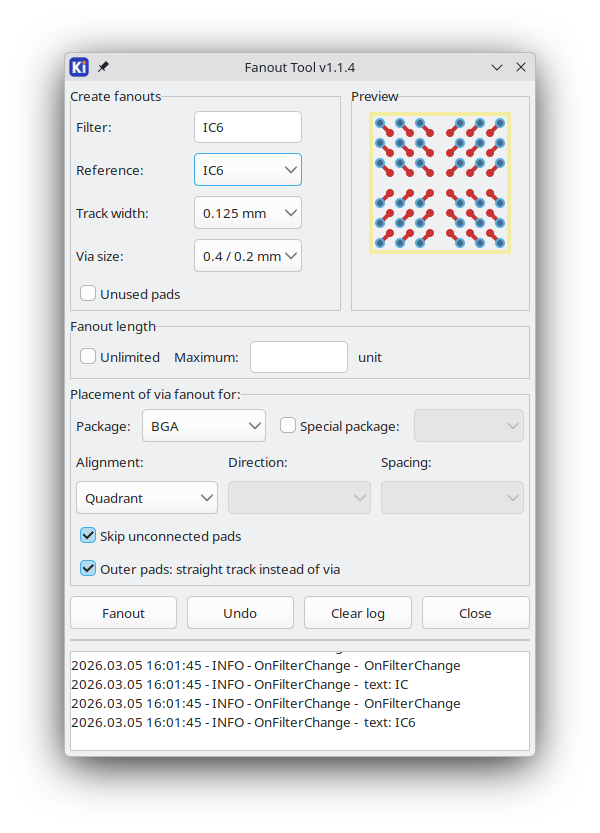

#  Fanout Tool

## History

This tool by [OneKiwi](https://github.com/OneKiwiTech) orignally has disappeared from their repositories. It claimed compatibility with KiCad v6 and v7.

This is a fork of a fork which was made compatible with KiCad v9. I
will try to keep adding future release compatibility for this `pcbnew`
[Action Plugin](https://dev-docs.kicad.org/en/apis-and-binding/pcbnew/index.html#_action_plugin_support)
but KiCad will remove the SWIG-based Python bindings in a future
version hence this code will need porting to the, more stable, IPC
API. See https://dev-docs.kicad.org/en/apis-and-binding/pcbnew/index.html for
more info.

## GUI


## Installation 💾

Use the Makefile as follows, from linux:
```
make uninstall
make install
```

TODO: For other platforms, use the zip file which is built here as part of GitHub Actions workflow.

Or build it yourself:
```
make release
```

## Demo Video
[](https://youtu.be/-J81S3inhoc)

## Licence and credits
Plugin code is licensed under MIT license, see LICENSE for more info.  
KiCad Plugin code/structure from:
- [kicad-jlcpcb-tools](https://github.com/Bouni/kicad-jlcpcb-tools)
- [wiki.wxpython.org](https://wiki.wxpython.org/ModelViewController)