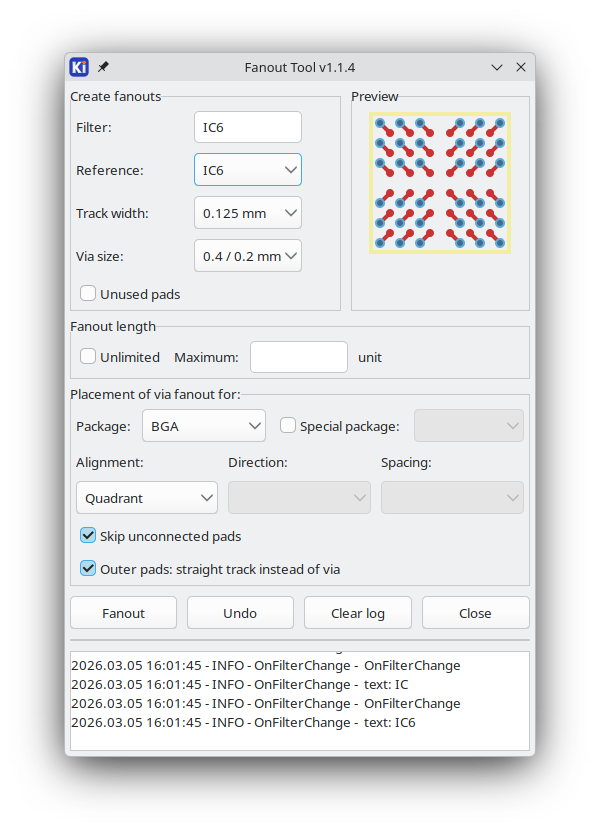
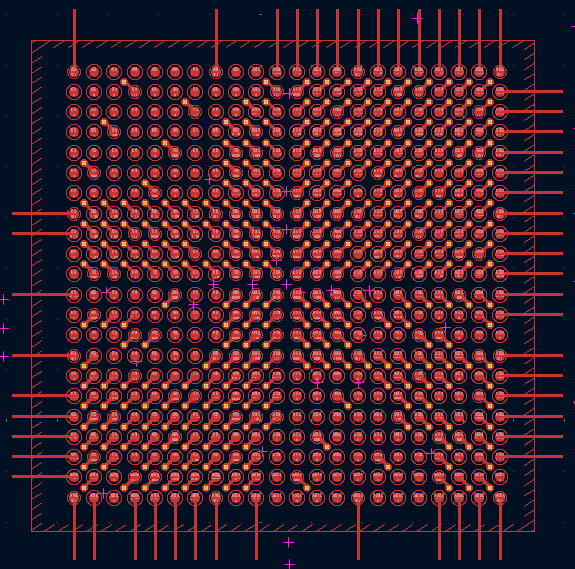

#  Fanout Tool

## History

This tool by [OneKiwi](https://github.com/OneKiwiTech) orignally has disappeared from their repositories. It claimed compatibility with KiCad v6 and v7.

This is a fork of a fork which was made compatible with KiCad v9 &
v10. I will try to keep adding future release compatibility.

## Changelog

### v2.0.0dev
- switch from using SWIG-based Python bindings to the new IPC API for compatibility with future KiCad v11

### v1.1.4
- Add option for outer BGA pads to use 3mm straight track (outward) instead of via

### v1.1.3
- Add option to skip unconnected pads during fanout (enabled by default)

### v1.1.2
- Focus on component when reference is selected
- Fix Filter typos in UI and controller
- Remove debug print and stderr logging

### v1.1.1
- Add Flatpak installation support to Makefile
- Fix KiCad 9 compatibility

## GUI





## Installation 💾

For all platforms, use the zip file which is part of the [releases](../../releases) here. Install it using KiCad Tools>Plugin and Content Manager>Install from file.

Or, for Linux, use the Makefile as follows (it supports native and flatpak installation):
```
make uninstall
make install
```

BTW releases are built from a tagged commit as follows:
```
make release
```

## Demo Video
[](https://youtu.be/-J81S3inhoc)

## Licence and credits
Plugin code is licensed under MIT license, see LICENSE for more info.  
KiCad Plugin code/structure from:
- [kicad-jlcpcb-tools](https://github.com/Bouni/kicad-jlcpcb-tools)
- [wiki.wxpython.org](https://wiki.wxpython.org/ModelViewController)